### Hi, I'm Meta-Develop 👋

B3 Electrical & Electronic Engineering @ [Tokyo Metropolitan College of Industrial Technology](https://www.metro-cit.ac.jp/)  
Focused on robotics, embedded systems, and PCB design.

I build hardware — drones, motor drivers, and tracking devices — and write the firmware to make them work. Most of my work lives on a bench, not in a repo. GitHub is where the software side ends up.

---

#### What I use

| | |
|---|---|
| **Languages** | C, C++, Python — Rust (learning) |
| **MCUs** | ESP32, STM32, PIC, Arduino |
| **Robotics** | ROS 2, micro-ROS, Gazebo |
| **CAD / EDA** | Fusion 360, KiCad, EAGLE |
| **Other** | Git, Linux, Docker, LaTeX |

---

#### GitHub

  <picture>
    <source media="(prefers-color-scheme: dark)" srcset="./profile/top-langs-dark.svg" />
    <source media="(prefers-color-scheme: light)" srcset="./profile/top-langs-light.svg" />
    
  </picture>
  &nbsp;&nbsp;
  <picture>
    <source media="(prefers-color-scheme: dark)" srcset="./profile/stats-dark.svg" />
    <source media="(prefers-color-scheme: light)" srcset="./profile/stats-light.svg" />
    
  </picture>

---

  <a href="https://x.com/Meta_for_Life">X</a> · <a href="https://www.linkedin.com/in/rikuto-uyama-181342264/">LinkedIn</a>

