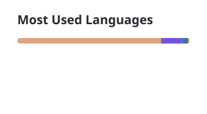

# Hi, I'm Meta-Develop 👋

B3 Electrical & Electronic Engineering @ [Tokyo Metropolitan College of Industrial Technology](https://www.metro-cit.ac.jp/)  
Focused on robotics, embedded systems, and PCB design.

I build hardware — drones, motor drivers, and tracking devices — and write the firmware to make them work. Most of my work lives on a bench, not in a repo. GitHub is where the software side ends up.

---

## What I use

<table>
  <tbody>
    <tr>
      <td><strong>Languages</strong></td>
      <td>C, C++, Python — Rust (learning)</td>
    </tr>
    <tr>
      <td><strong>MCUs</strong></td>
      <td>ESP32, STM32, PIC, Arduino</td>
    </tr>
    <tr>
      <td><strong>Robotics</strong></td>
      <td>ROS 2, micro-ROS, Gazebo</td>
    </tr>
    <tr>
      <td><strong>CAD / EDA</strong></td>
      <td>Fusion 360, KiCad, EAGLE</td>
    </tr>
    <tr>
      <td><strong>Other</strong></td>
      <td>Git, Linux, Docker, LaTeX</td>
    </tr>
  </tbody>
</table>

---

## GitHub

  <picture>
    <source media="(prefers-color-scheme: dark)" srcset="./profile/top-langs-dark.svg" />
    <source media="(prefers-color-scheme: light)" srcset="./profile/top-langs-light.svg" />
    
  </picture>
  <picture>
    <source media="(prefers-color-scheme: dark)" srcset="./profile/stats-dark.svg" />
    <source media="(prefers-color-scheme: light)" srcset="./profile/stats-light.svg" />
    
  </picture>

---

  <a href="https://x.com/Meta_for_Life">X</a> · <a href="https://www.linkedin.com/in/rikuto-uyama-181342264/">LinkedIn</a>

